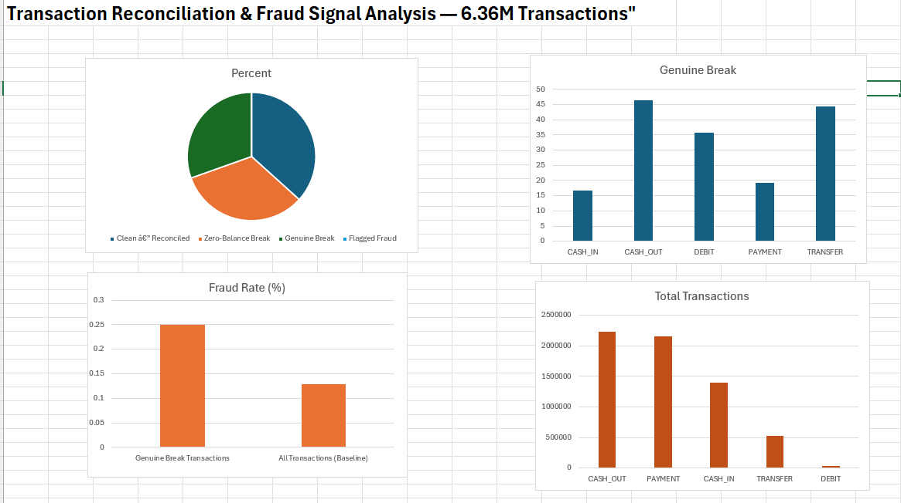

# Transaction Reconciliation & Fraud Signal Analysis

A self-directed project simulating an Operations-style reconciliation process on 6.36M financial transactions — verifying that transaction balances tie out correctly, categorizing discrepancies, and testing whether reconciliation breaks carry predictive signal for fraud.

## Dataset
[PaySim Synthetic Financial Dataset](https://www.kaggle.com/datasets/ealaxi/paysim1) (Kaggle) — 6.36M simulated mobile money transactions across 5 types (PAYMENT, TRANSFER, CASH_OUT, CASH_IN, DEBIT), with injected fraud labels.

> Raw data is not included in this repo (490MB, Kaggle-licensed) — download it directly from the link above and place it as `transactions.csv` in this folder to reproduce results.

## What this project does
1. **Reconciliation check**: verifies `oldbalance ± amount = newbalance` for both the sending and receiving side of every transaction — the same logic an Operations analyst uses to confirm a trade or transfer settled correctly.
2. **Break categorization**: classifies every transaction as Clean, a data-quality artifact (zero-balance accounts), or a genuine break needing investigation.
3. **Root-cause validation**: catches and corrects a direction-of-balance bug (CASH_IN credits the originator rather than debiting it) by inspecting real rows rather than trusting the first output.
4. **Fraud-signal testing**: compares the fraud rate inside flagged "genuine breaks" against the dataset baseline.

## Key findings
- **37%** of transactions reconcile cleanly, **33%** show a data-quality artifact (zero-balance accounts, a known PaySim simulator limitation), and **30%** are genuine breaks worth investigating.
- Genuine breaks concentrate heavily in **CASH_OUT (46.4%)** and **TRANSFER (44.5%)** — notably, the only two transaction types in this dataset where fraud actually occurs.
- Transactions flagged as genuine breaks show a fraud rate of **0.25%, roughly 2x the dataset's baseline rate of 0.13%** — suggesting reconciliation breaks are a meaningful early-warning signal, not just noise.
- Along the way, corrected a logic error where the reconciliation check assumed every transaction type debits the originating account — true for PAYMENT/TRANSFER/CASH_OUT/DEBIT, but wrong for CASH_IN (a deposit), which credits it instead.

## Tools
Python (pandas, numpy) · SQL · Excel (dashboard)

## Files
- `reconciliation_analysis.py` — main analysis script
- `reconciliation_queries.sql` — equivalent logic in SQL
- `dashboard_screenshot.png` — Excel dashboard summarizing findings

## Dashboard
# paysim-reconciliation-analysis
